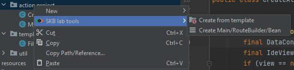

<h1>&nbsp;SKB LAB Tools</h1>

Generate java files from template

## Usage

1. Right click for generate files from template
2. Choose the path where to store the java file
3. The Java class is generated

> ⚠️ This software is distributed under a proprietary EULA. Source code is NOT available. Compilation, modification, and reverse engineering are strictly prohibited.